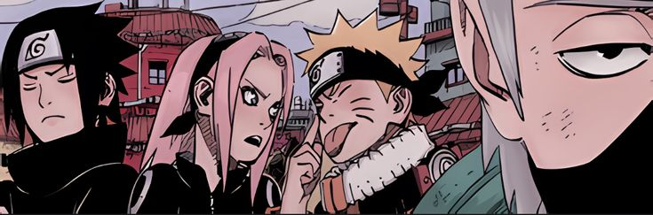

# 👋 Hey there, I'm Drew!

Welcome to my GitHub! I'm a Computer Science student at California State University, Fullerton, passionate about coding, learning new technologies, and grinding leetcode. I love working on projects that challenge me and help me grow as a developer.

## 💗 Right Now I'm...
- 🐍 Honing my DSA skills with Python!
- 🤖 Building a Discord Bot with a webapp interface!
- 🌱 Exploring C++ libraries, including raylib and JoltPhysics to develop a rigid body physics engine!

## 💻 About Me

- 🎓 Studying Computer Science at CSUF
- 💡 Enthusiastic about algorithms, data structures, and efficient software design
- ⚡ Spend way too much time perfecting my terminal-based environment (Alacritty, tmux, and Neovim)

## 🌟 What I Love to Work On

- 🧠 Low-level programming and compilers
- 🌍 Web development (preferably backend)
- 🔧 Optimizing workflows with custom scripts and automation

## 🛠️ Technologies I Use

  ### Programming Languages
  

         

  ### Coding Environment
    
  

## 🚀 Projects & Contributions

My projects are currently private for my classes. I'm always open to collaborating or discussing new ideas, so feel free to reach out!
